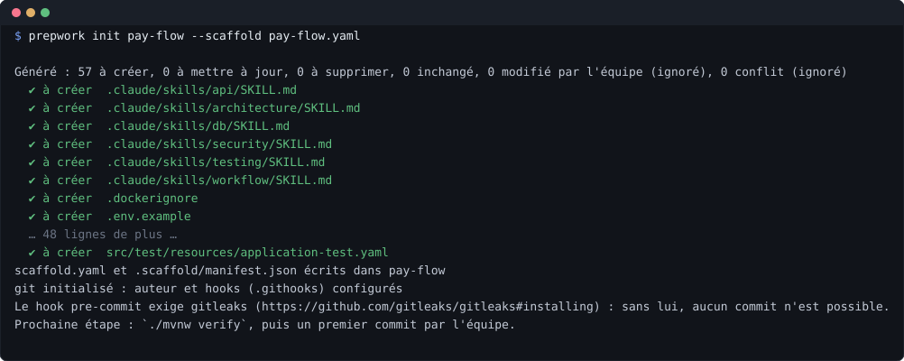
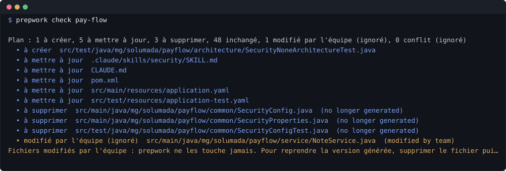
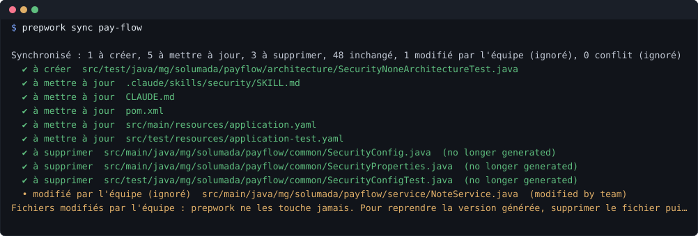

# prepwork

A TypeScript CLI that prepares the ground for a project before the first line of business code: a
ready-to-use skeleton, a reference example, tooled architecture rules, and the specifications
(`CLAUDE.md` + skills) for the AI agent that will code inside that skeleton.

Three stacks are shipped, each as a content pack on a stack-agnostic core (ADR 0007):
**Spring Boot** (Maven, ArchUnit, Testcontainers), **React** (Vite or Next.js, Tailwind tokens,
ESLint boundaries, Testing Library, Playwright) and **ASP.NET Core** (one project per layer, EF Core
migrations, NetArchTest, Testcontainers).

## At a glance

`init` writes the whole project from the answers collected in `scaffold.yaml`: the skeleton, the
reference example, the ArchUnit tests, the ADRs and the agent's own specification.



Later, the team edits a generated file and changes one answer — here `security: session` becomes
`security: none`. `check` says exactly what that implies and writes nothing (exit code 1 when the
project is out of date):



`sync` applies what is safe. The file the team modified is reported and left untouched — prepwork
never merges:



These three images are produced by `pnpm shots`, which replays the commands for real in a
throwaway directory and renders their actual output; the CLI speaks French. The interactive
questionnaire is not pictured: it needs a real terminal, which a script cannot provide.

## Prerequisites

- Node 22 LTS (or newer) and `pnpm` (via `corepack enable pnpm`)
- To verify a generated Spring Boot project: JDK 21 (or 17) and Docker (Testcontainers)
- To verify a generated React project: nothing more than Node and pnpm
- To verify a generated ASP.NET Core project: the .NET SDK named by its `global.json` (10.0.400 or
  newer in the same band) and Docker for the integration level

Without Docker, a generated project still builds and passes everything that does not touch a real
database; the Testcontainers levels are then verified nowhere but in CI.
[CONTRIBUTING.md](CONTRIBUTING.md) gives the exact commands and the traps.

## Development

```sh
pnpm install
pnpm check          # typecheck + lint + content/ consistency check + tests
pnpm check:content  # content/ consistency only (ids, prefixes, orthogonality, ArchUnit tests)
pnpm schemas        # regenerates schema/*.schema.json from the Zod schemas
pnpm shots          # regenerates the README pictures from real command runs
pnpm dev --help     # runs the CLI from the sources
```

**Changing the engine, a renderer or a pack? Read [CONTRIBUTING.md](CONTRIBUTING.md) first.** It
describes how to verify a generated project with its own toolchain, the round trip that proves
`check` and `sync` still protect the team's files, what a workstation cannot check at all, and why
a change to `content/` goes through a pull request rather than straight to `main`.

## CLI commands

```sh
pnpm dev init <dir>                      # interactive questionnaire, then generation
pnpm dev init <dir> --stack react        # the questionnaire of another pack (react, aspnet)
pnpm dev init <dir> --renderer agents-md # a single AGENTS.md instead of CLAUDE.md + skills
pnpm dev init <dir> --scaffold s.yaml    # no questionnaire (CI, tests)
pnpm dev check <dir>                     # reports the plan, writes nothing; exit code 1 when out of date
pnpm dev sync <dir>                      # applies the safe operations, reports the rest
```

| Command       | Role                                                                                                                                                                                      |
| ------------- | ----------------------------------------------------------------------------------------------------------------------------------------------------------------------------------------- |
| `init [dir]`  | Questionnaire of the chosen stack (`--stack`, or `--scaffold <file>`), `scaffold.yaml`, full generation into an empty directory, then `git init` + author + `core.hooksPath` (`--no-git`) |
| `check [dir]` | Computes the plan against `.scaffold/manifest.json` and reports it, without writing anything                                                                                              |
| `sync [dir]`  | Executes `create`, `update` and `delete`; `skip-modified` and `conflict` are only reported                                                                                                |

All three accept `--dry-run`. The plan vocabulary is described in
[docs/adr/0005-vocabulaire-du-plan.md](docs/adr/0005-vocabulaire-du-plan.md).

Once built (`pnpm build`), the executable is `node dist/cli/index.js` (or `prepwork` after
`npm link`).

## Shipped catalogue

**`spring-boot` pack**

| Axis          | v1 values                                                                         |
| ------------- | --------------------------------------------------------------------------------- |
| Profile       | `layered` (default), `modular` (Spring Modulith, events)                          |
| Migrations    | `migrations-flyway` (default), `migrations-liquibase` — absent without a database |
| Security      | `security-none` (default), `security-session`, `security-oauth2-resource-server`  |
| Other options | `docker`, `ci-github` (default) / `ci-gitlab`, `git` (always present)             |

**`react` pack**

| Axis          | v1 values                                                                            |
| ------------- | ------------------------------------------------------------------------------------ |
| Profile       | `spa-feature` — Vite SPA · `next-app` — Next.js App Router                           |
| Stack         | data: `tanstack-query` (default) / `none` · forms: `rhf` (default) / `none`          |
| Visual        | presets `app-sober` (default), `editorial`, `dense`, plus an optional dark theme     |
| Security      | `security-none` (default), `security-oidc-bff`, `security-session`                   |
| Other options | `state-zustand` / `state-context`, `i18n`, `e2e-playwright`, `docker`, `ci-*`, `git` |

**`aspnet` pack**

| Axis          | v1 values                                                                        |
| ------------- | -------------------------------------------------------------------------------- |
| Profile       | `layered` — one project per layer, boundaries held by the reference graph        |
| Stack         | database: `postgresql` (default) / `sqlserver` / `none` — migrations are EF Core |
| Security      | `security-none` (default), `security-cookie`, `security-jwt-bearer`              |
| Other options | `persistence-ef` (with a database), `docker`, `ci-github` / `ci-gitlab`, `git`   |

Versions are pinned by the tool, never asked: Spring Boot 4.1.1 (`src/packs/spring-boot/context.ts`),
React 19 with Vite and Tailwind 4 (`src/packs/react/context.ts`), .NET 10 LTS
(`src/packs/aspnet/context.ts`). On pull requests — and on demand, through the `workflow_dispatch`
trigger — the CI of this repository generates every combination of each pack and runs the generated
project's own toolchain: `mvn verify` for Spring Boot, `typecheck` + `lint` + `test` + `build` for
React, and `format` + `build` + `test` plus `dotnet ef migrations has-pending-model-changes` for
ASP.NET Core. A push straight to `main` runs `pnpm check` only: the matrices, hence every
Testcontainers level, need a pull request or a manual run.

## Layout

```
src/
  cli/            init / sync / check commands — thin, no logic
  questionnaire/  prompter and scripted prompter (the questions belong to a pack)
  config/         shared scaffold.yaml fragments, read/write, stack.target detection
  catalog/        loading and validation of content/ (core, profiles, options)
  engine/         composition → plan → execution; manifest
  packs/          one directory per stack: schemas, contributions, context, renderer strings
  renderers/      claude-code: YAML → CLAUDE.md + .claude/skills/
                  agents-md:   YAML → a single AGENTS.md
content/          data only: common/, spring-boot/, react/, aspnet/ — never code
schema/           JSON Schema generated from Zod (IDE completion), never hand-written
docs/adr/         decisions taken while implementing the tool itself
```
